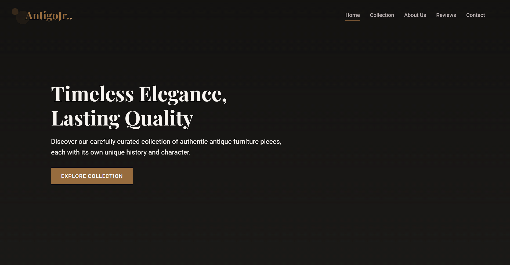
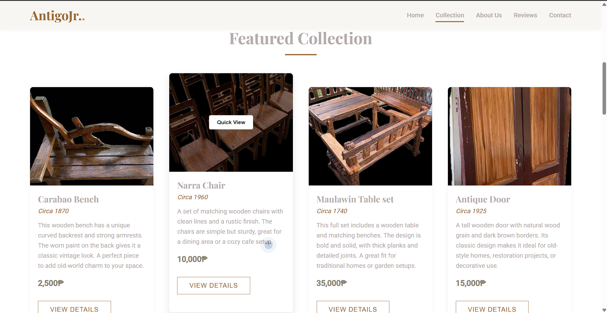

# 🏺 AntigoJR - Antique Business Website

## Project Overview  
AntigoJR is a static website created using HTML and CSS to showcase a family-owned antique business.  
It includes a homepage and a product collection page. The website is **live at [antigojr.online](https://antigojr.online)**, hosted using GitHub Pages and linked to a custom domain.

### 📸 Screenshots
**Homepage**  

**Collections Page**  

## Key Features
- **Homepage:** Simple landing page introducing the business.  
- **Product Gallery:** Clean display of antique item photos.  
- **Responsive Design:** Mobile-friendly layout using custom CSS.  
- **Live Hosting:** Deployed via GitHub Pages and connected to a real domain.

## Collaboration
Built individually for a Technopreneurship class.

## Technologies Used
- HTML  
- CSS  
- Git & GitHub Pages  

## 🌐 Live Site  
[https://antigojr.online](https://antigojr.online)
